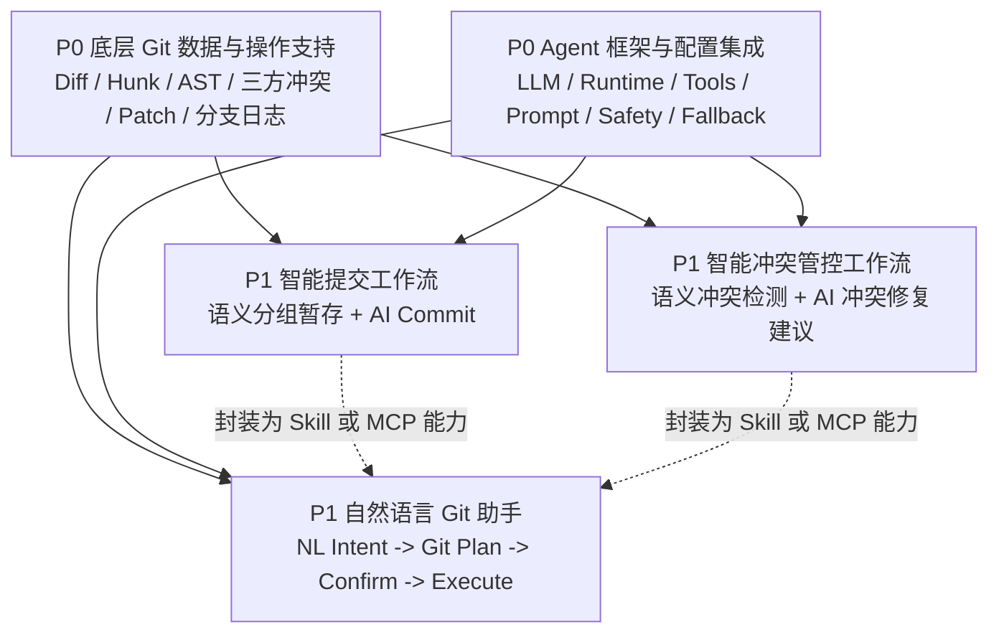

# IntelliGit Agent 工作分工需求清单

> 本文档用于明确当前阶段的工作范围、功能边界与分工依赖。  
> 当前阶段采用“双 P0 底座 + 三个 P1 工作流”的任务结构。

## 1. 工作范围总览

当前阶段聚焦以下 5 个工作包：

| 优先级 | 工作包 | 定位 |
|---|---|---|
| P0 | 底层 Git 数据与操作支持 | 提供 Diff、Hunk、AST、三方冲突、Patch、分支日志等数据与操作能力 |
| P0 | Agent 框架与配置集成 | 提供 LLM、Runtime、Tools、Prompt、Safety、Fallback 等 Agent 基础能力 |
| P1 | 智能提交工作流 | 提供语义分组暂存与 AI Commit 能力 |
| P1 | 智能冲突管控工作流 | 提供语义冲突检测与 AI 冲突修复建议能力 |
| P1 | 自然语言 Git 助手 | 提供自然语言 Git 操作入口，并复用提交与冲突能力 |

其中，两个 P0 工作包并列作为底座能力；三个 P1 工作包均依赖这两个底座。

## 2. 工作拓扑图

## 3. 分工说明

| 负责人方向 | 工作包 | 工作内容 |
|---|---|---|
| Git / Sidecar 方向 | 底层 Git 数据与操作支持 | 负责 Git 数据读取、AST 语义数据、冲突数据、Patch 应用、分支日志等能力 |
| Agent 基建方向 | Agent 框架与配置集成 | 负责 Agent Runtime、LLM 配置、工具注册、Prompt 管理、安全策略与降级能力 |
| 提交工作流方向 | 智能提交工作流 | 负责语义分组暂存、AI Commit、提交链路中的用户确认与执行 |
| 冲突工作流方向 | 智能冲突管控工作流 | 负责语义冲突检测、冲突上下文分析、AI 修复建议与应用 |
| 自然语言助手方向 | 自然语言 Git 助手 | 负责自然语言解析、Git 操作计划、风险分级、确认执行，并复用提交与冲突能力 |

## 4. P0：底层 Git 数据与操作支持

### 4.1 工作定位

该工作包负责向上层 Agent 与工作流提供结构化 Git 数据和可执行 Git 操作能力。

### 4.2 功能列表

| 功能域 | 功能项 |
|---|---|
| Diff 数据 | 获取工作区 Diff、暂存区 Diff、Commit 间 Diff、原始 unified diff |
| Hunk 数据 | 获取文件级 Hunk、Hunk 行范围、增删改行、Hunk 所属文件与状态 |
| 暂存操作 | 文件暂存、全部暂存、取消暂存、Hunk 级暂存、Hunk 级取消暂存 |
| Patch 操作 | 应用 Patch、反向应用 Patch、应用 AI 生成的修复 Patch、Patch 结果状态反馈 |
| Commit 数据 | 获取当前暂存区内容、创建 Commit、读取 Commit 历史、读取 Commit 详情 |
| Branch 数据 | 获取当前分支、本地分支、远程分支、ahead/behind、全分支提交历史 |
| AST 数据 | 提取变更所在函数、类、接口、模块导入导出、符号定义、符号调用点 |
| 语义 Diff 数据 | 将 Diff/Hunk 映射到 AST 逻辑块，并输出结构化语义上下文 |
| Merge 状态 | 判断是否处于 merge 状态、获取 MERGE_HEAD、获取未解决冲突文件 |
| 三方冲突数据 | 获取 ancestor、ours、theirs 三方内容，输出冲突文件与冲突区域 |
| 合并操作 | 继续合并、取消合并、标记冲突文件已解决 |

### 4.3 向 P1 工作流提供的数据

| 使用方 | 所需数据 |
|---|---|
| 智能提交工作流 | Diff、Hunk、AST 逻辑块、暂存状态、Patch 暂存能力、Commit 创建能力 |
| 智能冲突管控工作流 | 分支差异、AST 符号信息、三方冲突内容、冲突文件列表、Patch 应用能力、merge 状态 |
| 自然语言 Git 助手 | 当前仓库状态、分支状态、文件状态、提交历史、可执行 Git 操作能力 |

## 5. P0：Agent 框架与配置集成

### 5.1 工作定位

该工作包负责向所有 AI 工作流提供统一的 Agent 运行、LLM 调用、工具调用、安全判断与降级能力。

### 5.2 功能列表

| 功能域 | 功能项 |
|---|---|
| LLM Provider 配置 | API Key、Base URL、Model Name、Temperature、Max Tokens |
| LLM 连接状态 | 检查配置是否完整、检查模型是否可用、展示 AI 服务状态 |
| Agent Runtime | 接收任务、组装上下文、调用 LLM、解析结构化输出、返回执行结果 |
| Tool 注册 | 注册 Git Tool、Commit Skill、Conflict Skill、NLP Tool |
| Tool 调用 | Agent 可调用已注册工具，并接收工具返回的结构化结果 |
| Prompt 管理 | 管理提交、冲突、自然语言助手相关 Prompt 模板 |
| 输出约束 | 对 LLM 输出进行 JSON Schema 校验或结构化结果校验 |
| Safety 策略 | 识别高危 Git 操作、阻止极高危操作、触发二次确认 |
| Fallback | LLM 不可用时提供模板结果、基础操作、功能置灰或友好错误 |
| 错误展示 | 展示 AI 调用失败、配置缺失、输出解析失败等错误 |

### 5.3 向 P1 工作流提供的能力

| 使用方 | 所需能力 |
|---|---|
| 智能提交工作流 | 提交意图分析、提交信息生成、结构化输出解析、模板降级 |
| 智能冲突管控工作流 | 语义风险分析、冲突意图分析、修复策略生成、建议代码生成 |
| 自然语言 Git 助手 | 自然语言意图解析、Git 操作计划生成、风险分级、安全确认 |

## 6. P1：智能提交工作流

### 6.1 工作定位

该工作包负责完成“语义分组暂存 + AI Commit”的提交链路。

### 6.2 功能列表

| 功能域 | 功能项 |
|---|---|
| 变更读取 | 获取当前工作区 Diff、暂存区 Diff、文件状态、Hunk 列表 |
| 语义上下文 | 获取 Hunk 所在函数、类、接口、模块导入导出等 AST 信息 |
| 意图分析 | 将变更划分为 feat、fix、refactor、style、docs、test、chore 等提交意图 |
| 分组展示 | 展示按意图分组后的变更列表 |
| 分组暂存 | 支持按语义分组暂存变更 |
| 组内选择 | 支持在某个意图组内选择或取消选择单个文件、Hunk 或逻辑块 |
| Commit Message 生成 | 生成符合 Conventional Commits 的提交信息 |
| Commit Message 编辑 | 用户可编辑 AI 生成的提交信息 |
| 提交执行 | 用户确认后创建 Commit |
| 降级行为 | LLM 不可用时生成基础模板提交信息 |

### 6.3 可复用能力

智能提交工作流需要沉淀为可被自然语言 Git 助手复用的能力：

| 能力 | 功能 |
|---|---|
| `commit.analyzeChanges` | 分析当前变更内容 |
| `commit.groupByIntent` | 按提交意图分组 |
| `commit.stageGroup` | 暂存指定语义分组 |
| `commit.generateMessage` | 生成提交信息 |
| `commit.execute` | 执行提交 |

## 7. P1：智能冲突管控工作流

### 7.1 工作定位

该工作包负责完成“语义冲突检测 + AI 冲突修复建议”的冲突链路。

### 7.2 功能列表

| 功能域 | 功能项 |
|---|---|
| 分支上下文 | 获取当前分支、目标分支、来源分支、分支差异 |
| 语义冲突检测 | 检测调用-删除冲突、函数签名变更冲突、同函数并行修改、接口实现不一致 |
| 风险分级 | 输出高风险、中风险、低风险 |
| 风险说明 | 展示风险原因、涉及文件、涉及符号、涉及逻辑块 |
| Merge 状态识别 | 判断是否已经处于冲突状态 |
| 冲突文件读取 | 获取冲突文件列表 |
| 三方内容读取 | 获取 ancestor、ours、theirs 三方内容 |
| 冲突上下文分析 | 分析冲突区域所在函数、类、接口、调用关系 |
| AI 修复建议 | 生成推荐合并策略、建议代码、解释说明 |
| 应用修复 | 用户确认后应用建议代码或 Patch |
| 合并继续 | 所有冲突解决后继续 merge |
| 合并取消 | 用户可取消当前 merge |
| 降级行为 | LLM 不可用时展示三方内容、冲突文件和基础操作 |

### 7.3 可复用能力

智能冲突管控工作流需要沉淀为可被自然语言 Git 助手复用的能力：

| 能力 | 功能 |
|---|---|
| `conflict.detectSemanticRisks` | 检测语义冲突风险 |
| `conflict.explainRisk` | 解释冲突风险 |
| `conflict.getTripletContext` | 获取三方冲突上下文 |
| `conflict.suggestResolution` | 生成 AI 修复建议 |
| `conflict.applyResolution` | 应用修复建议 |
| `conflict.continueMerge` | 继续合并 |
| `conflict.abortMerge` | 取消合并 |

## 8. P1：自然语言 Git 助手

### 8.1 工作定位

该工作包负责提供自然语言 Git 操作入口，并复用智能提交和智能冲突管控能力。

### 8.2 功能列表

| 功能域 | 功能项 |
|---|---|
| 自然语言输入 | 用户输入口语化 Git 需求 |
| 意图解析 | 将自然语言解析为结构化 Git 操作意图 |
| 操作计划 | 生成可展示的 Git 操作计划 |
| 命令预览 | 展示将要执行的 Git 操作 |
| 风险分级 | 对 Git 操作进行安全、高危、极高危分级 |
| 安全确认 | 高危操作需要二次确认，极高危操作默认阻止 |
| 基础 Git 操作 | 支持 status、log、diff、branch、checkout、pull、push、reset soft 等常见操作 |
| 提交能力复用 | 调用智能提交工作流能力完成分组、暂存、提交信息生成和提交 |
| 冲突能力复用 | 调用智能冲突管控能力完成风险检测、冲突解释、修复建议 |
| 执行结果展示 | 展示操作成功、失败、阻止等结果 |
| 审计记录 | 记录自然语言输入、解析结果、执行命令、风险等级、执行结果 |
| 降级行为 | LLM 不可用时保留基础 Git 操作入口或提示配置 AI 服务 |

### 8.3 复用关系

| 用户意图类型 | 复用能力 |
|---|---|
| 生成提交信息 | `commit.generateMessage` |
| 按意图整理并提交 | `commit.groupByIntent`、`commit.stageGroup`、`commit.generateMessage`、`commit.execute` |
| 检查合并风险 | `conflict.detectSemanticRisks`、`conflict.explainRisk` |
| 解决当前冲突 | `conflict.getTripletContext`、`conflict.suggestResolution`、`conflict.applyResolution` |
| 执行普通 Git 操作 | 底层 Git Tool |

## 9. P1 能力复用要求

智能提交工作流和智能冲突管控工作流的核心能力需要封装为 Skill 或 MCP 能力，以便自然语言 Git 助手复用。

| P1 工作流 | 需封装能力 | 被复用方 |
|---|---|---|
| 智能提交工作流 | 变更分析、意图分组、分组暂存、提交信息生成、提交执行 | 自然语言 Git 助手 |
| 智能冲突管控工作流 | 风险检测、风险解释、三方冲突读取、修复建议、应用修复、继续合并 | 自然语言 Git 助手 |

## 10. 交付物清单

| 工作包 | 交付物 |
|---|---|
| 底层 Git 数据与操作支持 | Git 数据 API、AST 数据 API、冲突数据 API、Patch 操作 API、分支日志 API |
| Agent 框架与配置集成 | Agent Runtime、LLM 配置、Tool Registry、Prompt 模板、Safety、Fallback |
| 智能提交工作流 | 提交工作流页面或入口、Commit Skill/MCP、提交意图分组、AI Commit 生成 |
| 智能冲突管控工作流 | 冲突管控页面或入口、Conflict Skill/MCP、语义风险检测、AI 修复建议 |
| 自然语言 Git 助手 | NLP 命令中心、操作计划、风险分级、确认执行、审计记录、P1 能力复用入口 |

