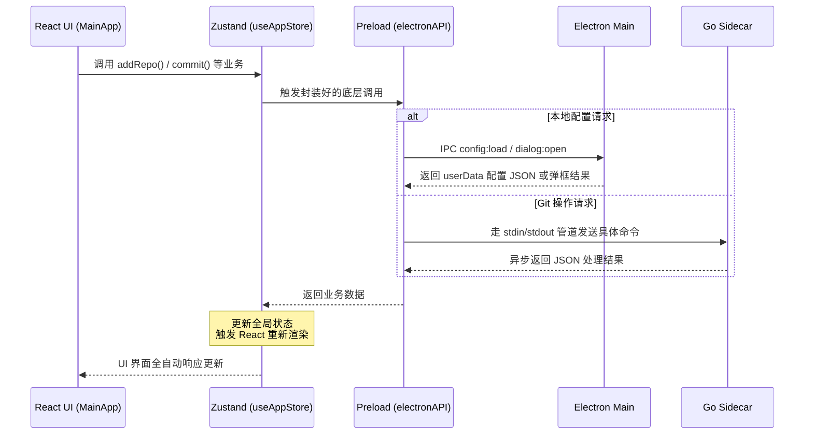

> 本文为山东大学软件学院创新实训项目博客

# 前端界面搭建记录

在开发 IntelliGit（一个基于 Electron + Go 的高性能 Git 桌面客户端）的过程中，打通了底层 IPC 通信机制后，我们面临了下一个重要挑战：**如何脱离粗糙的测试面板，构建一个功能完整、体验丝滑、且代码优雅的正式前端客户端？**

经过考量，我们抛弃了臃肿的第三方 UI 组件库，选择完全手写 CSS 和 React 组件。配合 Zustand 的全局状态管理，我们从零打造了一个轻量且极具原生感的 GitHub Desktop 风格界面。

在这篇博客中，我将事无巨细地复盘这个前端基建是如何一步步搭建起来的。从底层 IPC 接口的横向扩充，到应用层路由的无缝切换，再到全能的状态管理与细致入微的 CSS 打磨。

---

## 一、 架构概述

在开始写界面之前，必须明确前端 UI 是如何与操作系统（持久化配置）和 Go Sidecar（Git 核心逻辑）交互的。



---

## 二、 实现过程

### 1. 扩展 Main 进程与共享层

要让客户端能记住用户的个人设置和仓库列表，必须在主进程增加处理 GUI 原生能力和本地文件读写的逻辑。

**1. 扩展全端共享类型协议**
我在 `src/shared/types/sidecar.ts` 中加入了 `RepoConfig`（定义单个仓库的路径和 HTTP/SSH 鉴权信息）和 `AppConfig` 接口，并新增了 `CONFIG_LOAD`、`CONFIG_SAVE` 以及 `DIALOG_OPEN_FOLDER` 三个 IPC 通道，确保前后端类型一致。

**2. 编写配置控制器 (`configHandlers.ts`)**
在主进程中，我引入了 Electron 的 `dialog` 和 Node 的 `fs`。
**关键点：配置文件的安全落脚点**。最佳实践是存在 `app.getPath('userData')` 目录下，这样无论软件覆盖升级还是重装，用户配置的 `intelligit-config.json` 都不会丢失。

```typescript
// src/main/ipc/configHandlers.ts
import { app, dialog, ipcMain } from 'electron'
import { join } from 'path'
import fs from 'fs'

const CONFIG_FILE_PATH = join(app.getPath('userData'), 'intelligit-config.json')

export function registerConfigHandlers() {
  ipcMain.handle('config:load', async () => {
    if (!fs.existsSync(CONFIG_FILE_PATH)) return { repos: [], currentRepoPath: null }
    return JSON.parse(fs.readFileSync(CONFIG_FILE_PATH, 'utf-8'))
  })
  
  // 暴露操作系统原生的目录选择面板
  ipcMain.handle('dialog:openFolder', async () => {
    const { canceled, filePaths } = await dialog.showOpenDialog({ properties: ['openDirectory'] })
    return canceled ? null : filePaths[0]
  })
}
```

**3. 注册控制器并打通 Preload 桥梁**
写完 handler 后，我们在 `src/main/ipc/index.ts` 中集中将其注册。接着，在最关键的 `src/preload/index.ts` 预加载脚本里，将这些能力安全地挂载给渲染进程。同时，暴露出 `mode` 环境变量：

```typescript
// src/preload/index.ts
const api = {
  // 原有的 Sidecar 桥接
  invokeGit: (command: string, payload?: any) => ipcRenderer.invoke('git:command', command, payload),
  // 新增的系统交互桥接
  loadConfig: () => ipcRenderer.invoke('config:load'),
  saveConfig: (config: any) => ipcRenderer.invoke('config:save', config),
  openFolderDialog: () => ipcRenderer.invoke('dialog:openFolder'),
  // 透传环境变量用于入口路由分发
  mode: process.env.ELECTRON_MODE || 'main' 
}
contextBridge.exposeInMainWorld('electronAPI', api)
```

---

### 2. 配置应用入口路由

有了 `mode` 之后，在原来的 `src/renderer/src/App.tsx` 中，我加入了顶层的路由逻辑。当命令是 `npm run dev:test` 时渲染旧的命令测试面板，若是 `dev:main`，则无缝切换到我们真正要开发的主界面 `MainApp`。

---

### 3. 状态管理 (Zustand Store)

前端涉及极其庞杂的分散状态：已暂存/未暂存列表、50条历史记录、远程/本地分支树、当前仓库配置，还有各种独立操作的 Loading 状态。

我在 `src/renderer/src/store/useAppStore.ts` 创建了一个巨无霸的 Zustand Store（并在 `store/index.ts` 集中导出）。其核心思想是：**UI 层只负责无脑绑事件，所有的脏活、网络请求、配置同步全部下沉给 Store。**

**关键点一：业务流封装与级联刷新。**
切换仓库不只是改个字符串，它伴随着一系列复杂连锁反应：
```typescript
switchRepo: async (path: string) => {
    const { repos } = get()
    const repo = repos.find((r) => r.path === path)
    if (!repo) return

    set({ loading: true, error: null })
    
    // 1. 底层 Go Sidecar 切换当前工作目录
    const response = await window.electronAPI.invokeGit('repo.open', { path })
    if (response.success) {
      set({ currentRepo: repo })
      
      // 2. 将这次切换立刻写回本地 userData 的 JSON
      await persistConfig(repos, path) 
      
      // 3. 核心并发：同时从底层拉取 变更状态、提交记录、分支数据！
      const state = get()
      await state.refreshAll() 
    }
}
```

**关键点二：细粒度 Git 操作与鉴权参数组装。**
当执行 `Push` 或 `Pull` 时，Store 会自动从当前的 `currentRepo` 状态里提取出用户之前录入的 HTTP Username/Password 或者 SSH Key 路径，透明地塞入 Payload 传给底层 Go，保持组件层代码极其干净。所有的加/减/提交等操作，都会自带独立状态 `operationLoading` 防抖，并在成功后自动触发 `refreshAll`。

---

### 4. 视图组件实现

**基础设施就绪，开始搭建界面血肉。**

在 `MainApp.tsx` 中，我设计了经典的三栏/双栏格局，代码实现了高度模块化：
1. **左侧（RepoSidebar）**：本地仓库列表管理，支持系统窗口选择添加新仓库，Hover 时出现删除按钮。
2. **顶栏（Toolbar）**：当前高亮的仓库名、用绝对定位手写的分支切换下拉组件（包含 Head 高亮打勾），以及全局的 Push / Pull 独立按钮。
3. **主工作区（Content）**：根据 `activeView` 的状态，用条件渲染呈现三个核心业务区：
   - **变更视图 (ChangesView)**：分离“已暂存 (staged)”和“未暂存 (unstaged)”区域。每行文件有独立的 `＋/－` 按钮，顶部有全局 `全部暂存` 按钮。底端常驻一个具备状态校验的 Commit 消息输入框。
   - **历史视图 (HistoryView)**：采用时间轴（Timeline）样式，渲染包含提交哈希值、作者、时间的 50 条历史日志流。
   - **设置视图 (SettingsView)**：用于独立配置当前选中仓库的 HTTP(S) 与 SSH 鉴权信息。

此外，为了体验闭环，还手写了全局的底部状态栏和顶部自动销毁的 **消息横幅 (NotificationBar)**。

---

### 5. CSS 样式编写

在 `main.css` 中，我抛弃了任何预设样式，重新编写了将近 600 行的现代化原生级 UI 规范。

**关键点一：沉浸式的深色主题与材质。**
我定义了 `--bg-primary`、`--accent-blue` 等全局色彩变量，并给顶部工具栏加上了苹果风格的局部磨砂玻璃特性：
```css
.ig-toolbar {
  background: var(--bg-glass);
  backdrop-filter: blur(12px); 
  border-bottom: 1px solid var(--border-primary);
  -webkit-app-region: drag; /* 允许用户在此区域拖拽拖动 Electron 窗口 */
}
```

**关键点二：精致的视觉反馈与动效。**
所有的交互都没有生硬的切换：
- 全局加载时，顶部会出现一根使用 `var(--gradient-brand)` 渐变色的走马灯横向动画 `loadingSlide`。
- 通知横幅、分支选择下拉框出现时，带有一致的 `slideIn` 进场动效。
- Git 状态通过颜色直观分级，例如 Modified 显示橙色的 `●`，Added 显示绿色的 `＋`。

---

## 三、 总结

从主进程安全隔离本地读写、预加载脚本巧妙搭桥，到 Zustand 容纳万象掌控复杂状态，最后配合毫无累赘的原生 React + 极致打磨的 CSS，我们将 IntelliGit 从一行行冷冰冰的后端代码变成了一个完整、有温度的桌面客户端骨架。

在这套坚不可摧且高度封装的基础设施上，未来我们无论是挂载智能代码大模型审查、加入细腻的代码 Diff 视图，还是处理网络冲突，都将犹如顺水推舟，水到渠成。
