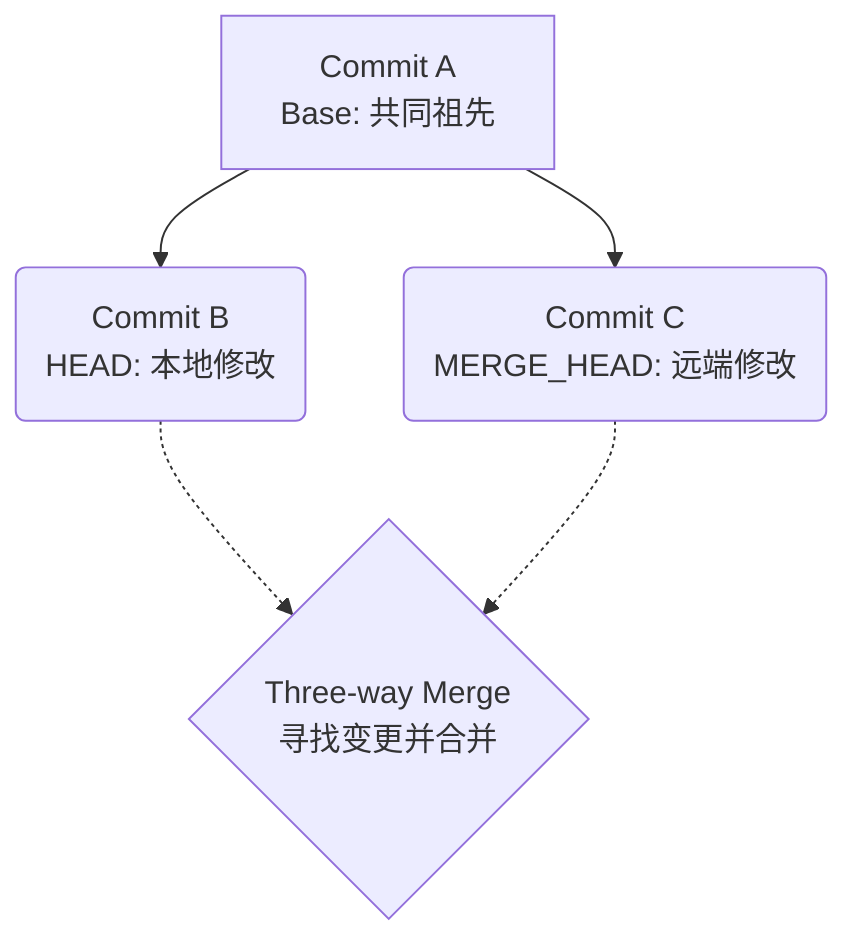
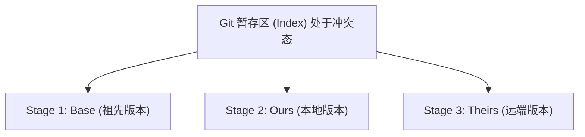
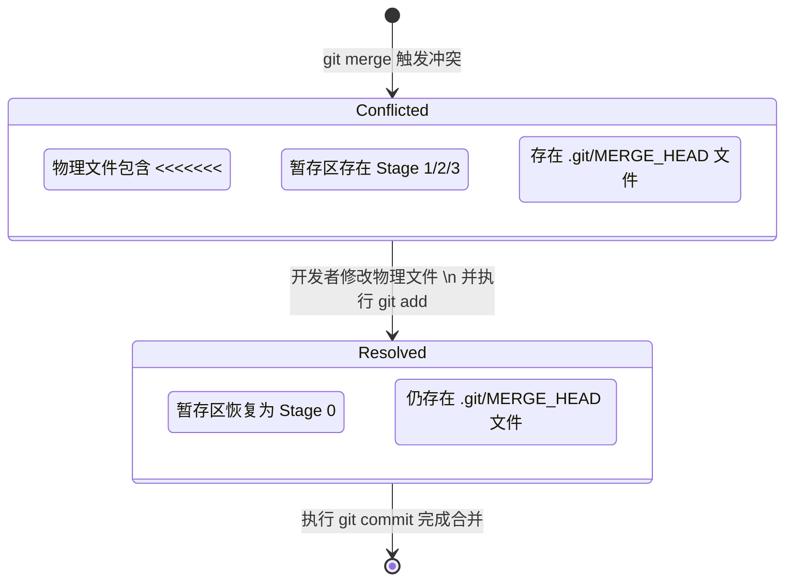

> 本文为山东大学软件学院创新实训项目博客

# 项目博客：原生 Git 的三方合并与冲突处理机制深度探究

在开发 IntelliGit 的智能化代码合并功能时，为了能够在上层正确地抽象和封装 API 并接入 AI 辅助处理，我们必须深入底层，彻底搞清楚原生 Git 究竟是如何处理代码合并以及应对代码冲突的。本文主要记录对 Git 核心合并机制的学习笔记与底层原理解析。

---

## 1. 从双向比对到三方合并 (Three-way Merge)

当我们在 Git 中执行 `git merge` 时，如果目标分支的历史与当前分支呈线性关系，Git 只需简单地移动指针，这被称为 Fast-forward（快进）合并。然而，在大多数真实协同开发场景中，分支的历史往往会发生分叉（Diverged）。

面对分叉的历史，很多人误以为 Git 只是简单地对比“当前分支”和“目标分支”的代码差异。实际上，纯粹的双向文本对比无法判定代码是“谁修改的”。例如，两边代码不一样，有可能是你加了一行，也有可能是对方删了一行。为了准确判断，Git 引入了**三方合并算法**。



算法的核心在于寻找一个“基准点”：
1. **定位基线 (Merge Base)**：Git 会遍历底层的有向无环图 (DAG)，找到当前分支 (HEAD) 和目标分支 (MERGE_HEAD) 的最近共同祖先提交 (图中 Commit A)。
2. **双向比对**：Git 分别计算从 Base 到 HEAD 的差异，以及从 Base 到 MERGE_HEAD 的差异。
3. **综合应用**：
   - 如果某一行代码只在其中一个分支被修改，Git 会自动采纳该修改（Auto-merging）。
   - 如果双方对同一行代码都进行了不同的修改，Git 就会判定为“冲突 (Conflict)”，暂停合并流程，交由人类接管。

---

## 2. 冲突状态下的暂存区 (Index) 裂变

当冲突发生时，Git 会立刻中止合并流程，让仓库进入一个特殊的“合并中间态”。这个状态最精妙的设计在于底层的 Index（暂存区）结构发生了裂变。

在平时，Index 中记录的文件处于正常的 `Stage 0` 状态。但在冲突发生时，对于那些无法自动合并的文件，Git 会在 Index 中为其同时写入三条独立的记录：



如果我们在底层执行 `git ls-files -u`，就能清晰地看到这三个版本的 Hash。此时，如果我们调用状态查询接口（如 `git status`），这类文件会被统一聚合并标记为 `Unmerged paths`（未合并状态，缩写 `UU`）。这种设计完美地保留了冲突现场的所有核心元数据，使得 Git 能够随时知道哪些文件还需要人工干预。

---

## 3. 物理文件的篡改与标记注入

除了在暂存区记录元数据外，Git 还会极其暴力地直接修改开发者工作区（Working Tree）中的物理文件。它会将冲突双方的代码连同标准的冲突标记一起强行拼接到纯文本文件中：

```text
<<<<<<< HEAD
fmt.Println("这是本地正在开发的实验性功能，优化了算法")
=======
fmt.Println("这是远端团队已经合入的稳定版代码，修复了空指针")
>>>>>>> origin/main
```

这种直接在纯文本中注入标记的做法看似粗暴，实际上却极其优雅：它将极其复杂的代码冲突降维成了最普通的**文本编辑问题**。不论是人类开发者使用 Vim/VSCode，还是未来我们接入的大语言模型，都只需要对这个纯文本文件进行常规的“阅读 -> 删除废弃行 -> 保存”操作即可，没有任何学习成本。

---

## 4. 状态流转与合并完结的底层逻辑

理解了上述机制，我们就很容易理清平时解决冲突的常规命令是如何在底层流转的了。



1. **执行 `git add`**：当我们在编辑器中删除了 `<<<<<<<` 等标记并保留了最终代码后，执行 `git add <file>`。这个命令在冲突态下具有特殊含义：它并非简单地暂存文件，而是会**彻底擦除该文件在 Index 中的 Stage 1、2、3 记录，并根据当前物理文件计算出一个新的哈希，写回为常规的 Stage 0 记录**。这标志着该文件“已解决”。
2. **执行 `git commit`**：当所有文件的冲突都被解决（Index 中不再有 Unmerged 文件）时，执行提交。Git 会检测到底层的 `.git/MERGE_HEAD` 文件存在，明白这不是一次普通的提交，而是一次合并。Git 会自动生成一个拥有两个父节点（Parent Hash）的 Merge Commit，并在完成后自动清理掉 `MERGE_HEAD` 和 `MERGE_MSG`，让仓库重回干净状态。
