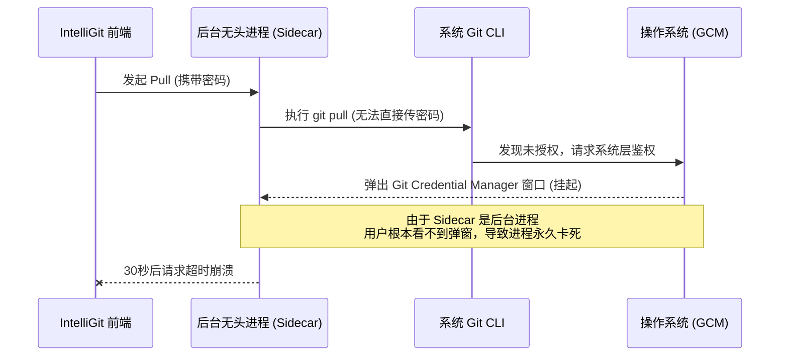
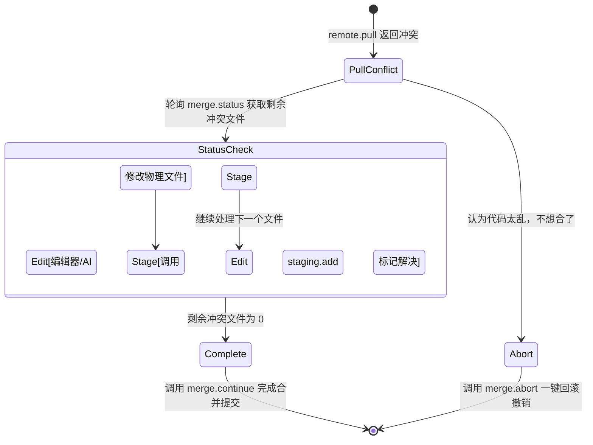

> 本文为山东大学软件学院创新实训项目博客

# 项目博客：基于 go-git 的混合合并架构与智能化冲突解决工作流设计

在设计 IntelliGit 的远程拉取 (Pull) 和合并 (Merge) 核心模块时，我们遭遇了一个经典的底层架构冲突：如何在使用 `go-git` 实现纯粹的内存态鉴权的同时，支持复杂的三方合并与冲突处理？

本文详细记录了我们在底层遇到的技术瓶颈，以及最终采用的“分层混合架构”设计思路，并梳理了专为应对大模型和人类协同设计的完整冲突解决工作流 API。

---

## 1. 核心痛点：go-git 的局限与 CLI 的鉴权灾难

项目的最初设计原则是“所有 Git 操作必须通过 go-git 库完成”。`go-git` 作为一个纯 Go 实现的 Git 库，在处理网络鉴权时非常优雅：我们可以直接将前端传入的 Username/Token 在内存层面注入，全程静默，毫无交互阻塞。

然而，`go-git` 的 `Worktree.Pull()` 存在一个致命的短板：**它不支持非快进式 (Non-fast-forward) 合并，且底层未实装 Three-way Merge（三方合并）引擎。** 一旦代码历史分叉，它会直接报错，无法在文件中生成 `<<<<<<<` 冲突标记。

为了填补这个缺陷，我们在初版方案中简单粗暴地将 Pull 操作替换为了系统原生命令 `exec.Command("git", "pull")`。但这立刻引发了可怕的**鉴权阻塞 Bug**。



---

## 2. 破局方案：分层混合 Pull 架构

为了兼顾“优雅的内存鉴权”与“强大的合并计算”，我重新设计了 `remote.go` 中的逻辑，采用了一种**分层降级策略 (Tiered Strategy)**：

```mermaid
graph TD
    Start[触发 Pull 操作] --> FF{调用 go-git 进行 Fetch/Pull}
    FF -- 网络获取+鉴权成功 <br/> 且为 Fast-forward --> Done[合并完成]
    FF -- 出现历史分叉 <br/> ErrNonFastForward --> Merge[调用本地 Git CLI 执行 Merge]
    
    Merge -- 执行 git merge --no-edit --> Check{是否冲突?}
    Check -- 否 --> Done
    Check -- 是 --> Parse[解析错误输出, 提取冲突文件列表]
    Parse --> Report[向前端返回 MergeConflictError]
```

核心思路在于：**网络归 Go，计算归 C**。
- **第一层**：优先调用 `go-git`。这一步完全利用了其完善的鉴权机制，安全、静默地把远端数据拉到本地 `.git` 目录中。
- **第二层**：当分叉发生时，数据已经在本地了。此时立即降级调用原生的 `git merge`。因为是**纯本地合并**，绝对不会触发网络鉴权弹窗。
- **终极防御**：为了双重保险，防止极小概率的编辑器弹窗，我在调用 CLI 时强制注入了隔离环境变量：
  ```go
  "GIT_MERGE_AUTOEDIT=no", // 绝对禁止弹出 Vim 等编辑器
  "GIT_TERMINAL_PROMPT=0", // 绝对禁止在终端弹出任何文字输入提示
  "GCM_INTERACTIVE=never", // 绝对禁止系统级凭据弹窗
  ```

---

## 3. 结构化冲突反馈机制设计

在成功触发安全的本地合并后，如果发生代码冲突，`git merge` 的标准输出 (Stdout) 是一大段非结构化的纯文本。如果在 API 层直接将长文本抛给前端，前端难以解析和展示。

为此，我们在 Sidecar 内部设计了正则提纯逻辑。专门从多行输出中精确捕获 `CONFLICT (<类型>): Merge conflict in <文件路径>` 格式的日志，提取出纯粹的冲突文件路径数组，并将其包装为强类型的 `MergeConflictError` 返回：

```json
{
  "success": false,
  "data": {
    "conflictedFiles": ["src/App.tsx", "package.json"],
    "mergingBranch": "origin/main",
    "message": "CONFLICT (content): Merge conflict in src/App.tsx..."
  }
}
```

---

## 4. 完备的智能化冲突解决 API 矩阵

为了支持接下来的开发（无论是由人类在 UI 上解决冲突，还是由接入的大语言模型 LLM 自动修改物理文件），我们在 Handler 层专门设计了一套符合状态机流转的 API 矩阵：



1. **`merge.status`**：底层通过检测 `.git/MERGE_HEAD` 文件是否存在，实时查询当前仓库是否处于合并中间态，并返回未解决的冲突文件列表。
2. **`staging.add`**：当 AI 模型或人类用户修改好物理文件、消除 `<<<<<<<` 标记后调用。它负责消除该文件在 Index 中的异常状态。
3. **`merge.continue`**：当所有冲突均标记解决后调用。底层自动执行 `git commit --no-edit`，利用系统预生成的合并信息完成最终的 Merge Commit，闭环合并流程。
4. **`merge.abort`**：容错机制，提供一键 `git merge --abort` 接口，帮助用户立刻将工作区回滚至合并前的一干二净的安全状态。

通过这套底层坚实、边界清晰的混合架构设计，IntelliGit 不仅彻底根治了恶劣的凭据弹窗阻塞 Bug，更为后续高度智能化的代码管理体验铺平了道路。
