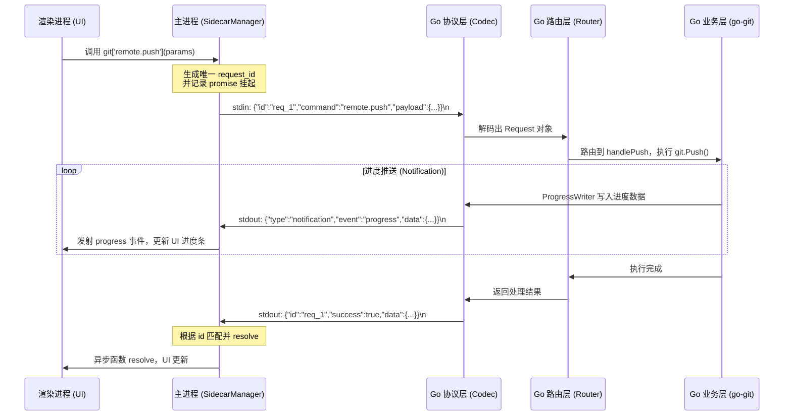

> 本文为山东大学软件学院创新实训项目博客

# 优雅实现 Electron 与 Go Sidecar 的 IPC 通信

在开发 IntelliGit（一个基于 Electron + Go 的高性能 Git 桌面客户端）的过程中，我们面临了一个关键的架构问题：**Node.js 主进程与 Go 语言编写的底层核心进程（Sidecar）之间，应该如何高效、稳定且“优雅”地进行通信？**

经过详细的调研和架构设计，我们最终抛弃了 HTTP、gRPC 和 Named Pipe 等方案，选择了一套**基于 `stdin/stdout` 的 JSON-RPC 通信架构**。并且在这一架构之上，我们通过巧妙的中间层封装，实现了前端对底层 Go 方法的“无感调用”（就像调用本地异步函数一样丝滑）。

在这篇博客中，我将像写“流水账”日记一样，带你一步步重温这个 IPC 中间层是从零开始如何搭建起来的。即使你对跨进程通信一无所知，跟着这篇开发记录，你也能完全搞懂其中的魔法。最后，我还会分享我们在开发中遇到的一个有趣的“无限重启”Bug 的排查与修复过程。

---

## 一、 设计哲学：为什么是 stdin/stdout？

当我们谈论跨语言进程间通信时，很多人第一反应是暴露一个 HTTP 接口，或者使用 gRPC。但在桌面应用场景下，这些方案存在明显弊端：

1. **端口冲突与安全漏洞**：HTTP/gRPC 需要占用本地网络端口，可能与用户机器上的其他服务冲突。更头疼的是，暴露端口可能会触发系统防火墙弹窗，且存在被恶意应用调用的安全风险。
2. **部署复杂度**：gRPC 需要引入繁重的 proto 工具链，而我们的接口数量相对有限，维护 proto 文件的成本偏高。

最终，我们对标了行业标杆——**VS Code 的 LSP（Language Server Protocol）架构**。VS Code 及其生态中的各类语言服务，都是通过父子进程的 标准输入/输出（stdin/stdout） 来进行 JSON 数据的交互。

**使用 `stdin/stdout` 的压倒性优势：**
- **零网络开销、零端口占用**：完全避开防火墙，极度安全。
- **天然的生命周期绑定**：Electron 父进程一旦退出，Go 子进程的 `stdin` 会立刻收到 `EOF` 信号，从而实现完美、干净的优雅退出。
- **跨平台一致性**：无论是 Windows、macOS 还是 Linux，管道通信的表现完全一致。

---

## 二、 核心架构全景图

在开始写代码之前，我们在白板上画出了整个通信的流转图。简单来说就是：
**前端触发调用 -> Node.js 组装 JSON 写入管道 -> Go 读取解析并路由 -> 执行业务 -> Go 将结果 JSON 写入管道 -> Node.js 解析并返回给前端。**



有了这个蓝图，我就开始动手了。

---

## 三、 步步为营的实现日记

### 第一步：搭建通信基石（Go 协议层）

**我的第一个目标是：让 Go 能听懂 Node 发来的话。**
既然是通信，肯定得先有个标准格式。我在 Go 端建了 `message.go`，定义了三个结构体：
- `Request`：Node 发来的请求（必须有 `ID` 和 `Command`）。
- `Response`：Go 处理完回传的结果（带上同样的 `ID`，以及成功失败的标志）。
- `Notification`：用于 Go 主动推送进度条等事件（没有 ID，是单向的）。

光有数据结构不行，得有“读取”和“发送”的工具。于是我写了一个 `Codec`（编解码器）：
```go
// Codec 从 stdin 一行行读，往 stdout 一行行写
type Codec struct {
	scanner *bufio.Scanner
	encoder *json.Encoder
	writer  io.Writer
	mu      sync.Mutex // 防止多个协程同时往 stdout 打印导致 JSON 串行错乱
}

func (c *Codec) ReadRequest() (*Request, error) {
    // 每次 Scan() 读取一行 JSON
	if !c.scanner.Scan() {
		return nil, io.EOF // Node 退出了，就会返回 EOF
	}
	var req Request
	json.Unmarshal(c.scanner.Bytes(), &req)
	return &req, nil
}
```
**关键点**：由于后续读取大文件的 git diff 时 Payload 会非常大，我还特意给 `Scanner` 设置了最高 10MB 的缓冲，防止大请求直接把管道撑爆。

### 第二步：打造聪明的“大脑”（Go 路由层）

**有了通信能力后，我发现第二个问题：请求来了，该交给谁去处理？**
不可能在 `main` 里面写几百个 `if-else`。我需要一个“路由器”。

我定义了一个 `HandlerFunc`：任何想要被 Node 调用的函数，都必须长成这样：
`func(ctx *Context) (any, error)`

接着我实现了一个 `Router`。它的核心其实就是一个 map（字典），把字符串名称（比如 `"repo.open"`）映射到具体的函数：
```go
type Router struct {
	handlers map[string]HandlerFunc
	repo     *git.Repository // 当前打开的 Git 仓库
}

func (r *Router) Dispatch(req *protocol.Request) *protocol.Response {
	handler, ok := r.handlers[req.Command]
	if !ok {
		return &protocol.Response{ID: req.ID, Success: false, Error: "未知命令"}
	}
    // 把参数包一包，传给具体的业务函数
	ctx := &Context{ RequestID: req.ID, RawPayload: req.Payload }
	data, err := handler(ctx)
    // ... 封装成 Response 返回
}
```
有了这个机制，我在 `registry.go` 里愉快地写下了几十行注册代码：
```go
r.Register("repo.open", handleRepoOpen)
r.Register("staging.status", handleStatus)
// ...
```
现在，Go 侧的框架基本成型了。

### 第三步：串联主循环（Go 端入口）

**万事具备，只欠东风。**我创建了 `cmd/sidecar/main.go`，写下了一个永远不会停止的 `for` 循环：
```go
func main() {
	codec := protocol.NewCodec(os.Stdin, os.Stdout)
	router := handler.NewRouter(notifier)
	handler.RegisterAll(router)

    // 死循环不断读取
	for {
		req, err := codec.ReadRequest()
		if err == io.EOF {
			break // Node 把 stdin 关了，Go 也就懂事地退出了
		}
		resp := router.Dispatch(req)
		codec.WriteResponse(resp)
	}
}
```
至此，Go 侧的开发全部完成。它安静地等着 Node 来唤醒它。

### 第四步：Node.js 基建（SidecarManager 发送与接收）

**现在，舞台交给了 Electron 的主进程。**
我写了一个类 `SidecarManager`，它主要负责用 `child_process.spawn` 把刚写好的 Go 编译出的 `.exe` 程序拉起来。

它的难点在于：**如何把异步的调用和管道里出来的文本匹配上？**
我想了个办法：
1. 发送请求前，我生成一个唯一的 ID（比如 `req_123`）。
2. 我创建一个 Promise，但**不立刻 resolve**，而是把它的 `resolve` 函数存到一个字典 `pendingRequests` 里，键就是这个 ID。
3. 把带 ID 的 JSON 写入 `stdin`。

```typescript
// 伪代码演示
const id = `req_${Date.now()}`
const promise = new Promise((resolve) => {
    this.pendingRequests.set(id, resolve)
})
this.process.stdin.write(JSON.stringify({ id, command }) + '\n')
return promise
```

然后，我监听 `stdout`。每当 Go 返回一行 JSON 时，我解析出里面的 ID，从字典里把那个苦苦等待的 `resolve` 拿出来执行：
```typescript
this.process.stdout.on('data', (chunk) => {
    // 处理换行拼接...
    const msg = JSON.parse(line)
    if (msg.type === 'notification') {
        this.emit('notification', msg) // 这是为了进度条推送
    } else {
        const resolve = this.pendingRequests.get(msg.id)
        resolve(msg)
        this.pendingRequests.delete(msg.id)
    }
})
```
完美！一个完整的闭环打通了。

### 第五步：前端的魔法（ES6 Proxy 无感调用）

虽然 Node 层能工作了，但是作为前端开发，每次都要写 `sidecarManager.send("staging.status", { path: "..." })` 还是觉得不够优雅。
**有没有可能，让我像调用本地 JS 对象一样去调用 Go 代码？**

我祭出了前端的魔法武器——**ES6 Proxy**。我在 `SidecarManager` 里加了一个函数：
```typescript
createProxy() {
  return new Proxy({}, {
    get: (target, methodName) => {
      // 拦截开发者访问的属性名，比如 methodName = 'staging.status'
      return (payload) => {
        // 自动帮他转成底层 send 的调用
        return this.send(methodName, payload).then(res => res.data)
      }
    }
  })
}
```
有了这段代码，在前端，我就可以这么写业务了：
```typescript
const git = sidecarManager.createProxy()

// 像魔法一样！它实际上底层跨越了进程，用管道发给了 Go，然后等 Go 返回再解析！
const status = await git['staging.status']() 
```

---

## 四、 抓虫日记：解决无限重启 Bug

在刚完成上述基础设施后，我给 `SidecarManager` 加了一个看似很周到的功能：**崩溃自动重启**。

我最初是这么写的逻辑：
```typescript
start() {
    this.process = spawn(...)
    this.process.on('exit', () => {
        this.tryAutoRestart() // 退出就重启
    })
    this.restartCount = 0 // 启动结束，重置重启计数！
}

tryAutoRestart() {
    if (this.restartCount >= 3) return console.log("彻底死了，不重启了");
    this.restartCount++;
    this.start();
}
```
**结果灾难发生了**。有一次我改坏了 Go 的代码，导致 Go 进程一启动就抛错崩溃（也就是活不过 100 毫秒）。
预期的结果是：重启 3 次后放弃。
实际的结果是：电脑风扇狂转，Node.js 陷入了**无限循环重启**中！

**排查原因：**
仔细走一遍逻辑就能发现漏洞：
1. 第一次崩溃 -> `tryAutoRestart` 触发 -> `restartCount` 变成 `1` -> 调用 `start()`。
2. 进入 `start()` -> 进程刚 spawn 出来 -> 执行到了最后的 `this.restartCount = 0`。
3. 进程此时因为 Go 的代码错误再次崩溃 -> `tryAutoRestart` 触发 -> `restartCount` 又是从 `0` 变成 `1`。

没错，**每次启动无论成功失败，计数器都被无脑清零了**，导致 `restartCount >= 3` 这个阻断条件永远不会成立！

**解决方案：引入“稳定性阈值”**
不能一启动就清零计数器，必须等进程**活过一定时间**（比如 5 秒），才承认这次启动是成功的。

我引入了一个 `stabilityTimer` 计时器来修复这个逻辑漏洞：
```typescript
// 进程存活超过阈值（5秒）才视为启动成功，此时才重置 restartCount
this.stabilityTimer = setTimeout(() => {
    this.restartCount = 0
    this.stabilityTimer = null
}, 5000)

this.process.on('exit', () => {
    // 进程退出时，如果 5 秒的计时器还在，说明没活过 5 秒，我们赶紧把它取消掉
    // 这样 restartCount 就不会被清零了！
    if (this.stabilityTimer) {
        clearTimeout(this.stabilityTimer)
        this.stabilityTimer = null
    }
    this.tryAutoRestart()
})
```
加了这两段代码后，系统完美处理了“秒崩”的情况，达到了 3 次重试失败后彻底放弃的预期目标。Bug 顺利解决！

---

## 五、 实战指南：如何添加一个新的 Git 函数？

因为上面打下的坚实基础，现在当我们需要在底层支持一个新的 Git 操作时，只需要非常简单的 2 个步骤：

**假设场景：增加一个查询当前 Git 仓库远程分支的功能 (`branch.listRemote`)。**

**步骤 1：在 Go 端编写 Handler 实现**
打开 `handlers.go`：
```go
func handleRemoteBranches(ctx *Context) (any, error) {
    // 获取当前上下文的 Repository 实例
	repo, err := ctx.Repo()
	if err != nil { return nil, err }
    
    // 调用 go-git 方法返回结果，Router 会自动把它变成 JSON
	return repo.RemoteBranches() 
}
```

**步骤 2：在 Go 端暴露路由**
打开 `registry.go`：
```go
r.Register("branch.listRemote", handleRemoteBranches) 
```

**结束！不需要改任何底层协议代码。** 前端直接 `await git['branch.listRemote']()` 就能拿到数据了。就是这么优雅。

---

## 六、 结语

通过剥离编解码层、构建 `Router` 分发中心，并结合 Node 端的 `ES6 Proxy` 与 `EventEmitter`，我们为 IntelliGit 打造了一套高吞吐、零网络占用、开发体验极佳的 IPC 中间层。

这套基础设施不仅经受住了考验，还大幅提升了后续开发 Git 业务功能的效率。这也是现代桌面应用混合架构（Web UI + Native Sidecar）中，我认为最漂亮的一种实践模式。
