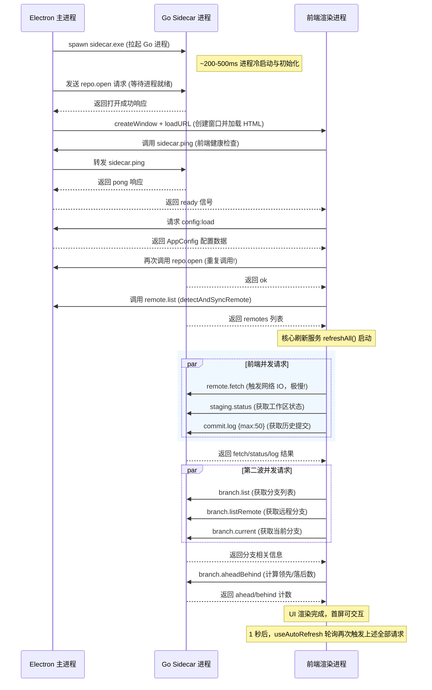

> 本文为山东大学软件学院创新实训项目博客

# 深入骨髓的性能剖析：IntelliGit 启动与 Diff 优化的前世今生

在开发 IntelliGit（一个基于 Electron + Go Sidecar 架构的高性能 Git 桌面客户端）的过程中，我们始终在追求极致的响应速度与流畅的用户体验。然而，随着项目规模的扩大和测试仓库体积的增加，我们渐渐发现了一些令人头疼的“慢动作”：
- **启动连接慢**：双击打开应用，界面白屏或骨架屏停留时间过长，等待后端 Sidecar 连接和初始化仓库显得非常迟钝。
- **Diff 视图加载慢**：在工作区变更列表中切换大文件或者查看改动较多的文件时，Diff 视图的渲染有明显的卡顿和延迟。
- **History 提交历史获取慢**：当仓库拥有成千上万个 commit 时，切换到历史 Tab 页，列表要加载好一会儿才能展示出来。

作为追求极致的开发者，我们显然不能容忍这些性能瑕疵。因此，我们对 IntelliGit 进行了一次全链路的性能审计与瓶颈分析。我们通过在关键节点植入高精度的打点耗时监控，深入到 Go 底层源码和前端 React 渲染流程的毛细血管中，终于揪出了 6 大核心性能瓶颈，并制定了一套详尽的“分阶段重构优化蓝图”。

这篇博客将带你像读侦探小说一样，一步步拆解这些隐藏在跨进程通信、算法、数据结构和生命周期中的“性能杀手”，并分享我们的破局之道。

---

## 一、 揭秘 IntelliGit 的启动关键路径（Critical Path）

在寻找瓶颈之前，我们首先需要理清：**当用户双击 IntelliGit 图标到首屏完全渲染出来，系统内部究竟发生了什么？**

IntelliGit 采用了 **React 渲染进程 + Electron 主进程 + Go Sidecar 核心进程** 的混合架构。我们梳理了它们之间的时序关系，绘制出了下面这张**启动关键路径全景图**：



看着这张密密麻麻的时序图，我们不禁倒吸一口凉气。在短短的启动黄金一秒钟内，系统内部竟然存在着如此庞大的请求交互、重复的无效调用，以及致命的网络 IO 阻塞！

顺着这条链路，我们逐一解构了六大性能“绊脚石”。

---

## 二、 深度解构六大性能“绊脚石”

### 绊脚石 #1：Go Sidecar — `wt.Status()` 中的 $O(n^2)$ 线性扫描

**严重程度：🔴 极高**

在 Git 客户端中，获取工作区的文件状态（Status）是最高频的操作。在 Go Sidecar 中，这个功能由 `sidecar/internal/git/staging.go` 中的 `Status()` 方法实现。

然而，当我们翻阅其源码时，发现了两个极其严重的性能黑洞：
1. **全局扫描**：方法内部直接调用了 go-git 的 `wt.Status()`。对于包含数千个文件的大型仓库，go-git 需要完整扫描整个工作区文件树，并逐一与 Git Index 进行比对，这本身就是一项极其繁重的 CPU 密集型任务。
2. **二次验证的 $O(n^2)$ 查找**：为了处理一些复杂的文件状态，代码在 L33-108 中实现了一套二次验证逻辑。对于每一个被标记为 `Modified` 的文件，它都会去 Index 中查找其对应的条目。然而，查找的代码居然长这样：
   ```go
   // 遍历所有的修改文件
   for _, file := range modifiedFiles {
       // 线性扫描 Index 中的所有条目！
       for _, entry := range idx.Entries {
           if entry.Name == file.Path {
               // 执行比对逻辑...
           }
       }
   }
   ```
   如果一个仓库有 $n$ 个索引条目（对于中大项目，这轻而易举达到几千甚至上万），当前有 $k$ 个文件发生了修改，那么这个查找的复杂度就是可怕的 $O(k \times n)$！每次刷新状态，CPU 都在做几百万次无意义的字符串匹配。

更糟糕的是，**相同的问题同样潜伏在 `diff.go` 中**。在 `DiffWorkdir()` 和 `DiffStaged()` 里（L49-61, L133-146），同样在使用 `for _, entry := range idx.Entries` 进行线性匹配。而且，即使前端仅仅想请求**单个文件**的 Diff 差异，后端也会重新调用一次全局的 `wt.Status()`！这简直是杀鸡用牛刀。

---

### 绊脚石 #2：Go Sidecar — 串行阻塞的单线程分发循环

**严重程度：🔴 极高**

在之前的项目博客《优雅实现 Electron 与 Go Sidecar 的 IPC 通信》中，我们介绍了基于 `stdin/stdout` 的管道通信框架。Go 端的入口位于 `sidecar/cmd/sidecar/main.go`。

然而，当我们重新审视其主循环时，发现了一个致命的架构缺陷：
```go
func main() {
    // ... 初始化 Codec 和 Router ...
    for {
        req, err := codec.ReadRequest()
        if err == io.EOF {
            break
        }
        resp := router.Dispatch(req) // 阻塞调用！
        codec.WriteResponse(resp)
    }
}
```
**它是完全串行的！** 

虽然前端渲染进程通过 `Promise.all()` 并发发送了 `staging.status`、`commit.log`、`remote.fetch` 等多个请求，但一旦它们通过管道到达 Go 侧，就只能在 `for` 循环中像排队买票一样**串行处理**。

这意味着：
$$\text{总延迟} = \text{Staging.status} + \text{Commit.log} + \text{Remote.fetch (网络IO延迟)}$$

任何一个命令变慢（特别是带网络请求的 `fetch`），都会将整个管道完全堵死，后续到达的刷新请求只能在输入缓冲区中苦苦等待，进而引发前端界面的全面假死和请求堆积。

---

### 绊脚石 #3：前端渲染进程 — 启动流程的瀑布式串行与重复调用

**严重程度：🟠 中高**

回到前端，我们查看了 `repositoryWorkflowService.ts` 中的 `loadConfig()` 启动逻辑。发现它的执行链条极其冗长，呈现典型的“瀑布式（Waterfall）”串行结构：

```
loadConfig() 
  └── loadRepositoryConfig()
        └── configClient.loadConfig()         // IPC 往返延迟 ~5ms
              └── invokeGit('repo.open')      // 【重复调用！】主进程已经打开过了！
                    └── detectAndSyncRemote()
                          └── invokeGit('remote.list') // 又一次 IPC 往返
                                └── refreshAll()
                                      └── Promise.all([
                                            refreshRemote(), // 【致命】包含了 remote.fetch 网络 IO！
                                            refreshStatus(), // 触发 staging.status
                                            refreshHistory() // 触发 commit.log
                                          ])
```

这里有两个非常低级的性能消耗：
1. **重复打开仓库**：Electron 主进程在拉起 Sidecar 时就已经自动执行过一次 `repo.open` 了，而前端在初始化时由于逻辑解耦不够彻底，无脑又发送了一次 `repo.open`。
2. **首屏被网络 IO 强行绑架**：`refreshAll()` 将 `refreshRemote()`（其中包含 `git fetch` 操作）与本地数据的加载并列放在了同一个 `Promise.all()` 中。这就导致，如果用户的网络环境稍差，或者远程 Git 服务器响应缓慢，首屏界面就会被卡在空屏状态，直到 `fetch` 网络请求超时或返回，用户才能看到本地的提交历史和文件变更！

---

### 绊脚石 #4：前端渲染进程 — 1 秒无脑轮询与请求堆积

**严重程度：🟠 中高**

在 `src/renderer/src/app/useAutoRefresh.ts` 中，我们发现了一个简单粗暴的定时刷新机制：
```typescript
// 每隔 1000ms 刷新一次本地状态
setInterval(() => {
    refreshAllLocal()
}, 1000)
```
而这个 `refreshAllLocal()` 每次触发都会向后端发送一波密集的请求雨：
`staging.status` + `commit.log {max:50}` + `branch.list` + `branch.current` + `branch.aheadBehind`……

如果用户的项目仓库非常庞大，或者 CPU 比较繁忙，后端处理这一波请求的时间超过了 1 秒（比如需要 1.5 秒）。由于该轮询**没有任何防重入（Reentrancy Guard）和锁机制**，前一次请求还没跑完，1 秒钟期限已到，新一轮的 5 个请求又劈头盖脸地砸了过来！

久而久之，Go 进程的管道队列里堆积了成百上千个过期的刷新任务，CPU 占用率飙升到 100%，应用彻底卡死。

---

### 绊脚石 #5：Go Sidecar — Myers Diff 算法的内存拷贝重灾区

**严重程度：🟡 中**

为了在不依赖本地 Git 客户端的情况下展示文件差异，我们在 `sidecar/internal/git/diff.go` 中自己实现了一套 Myers Diff 算法。

然而，在性能测试中，当对比两个超过 1000 行的文件时，耗时呈指数级上升。我们分析了 `myersDiff()` 的核心实现（L240-303）：
```go
// 在搜索网格的每一步中
for d := 0; d <= max; d++ {
    for k := -d; k <= d; k += 2 {
        // ... 寻找最优编辑路径 ...
        
        // 关键致命点：每一次移动，都将前一步的完整路径切片进行了一次深拷贝！
        newPath := make([]editOp, len(prevPath))
        copy(newPath, prevPath)
        paths[k] = append(newPath, op)
    }
}
```
Myers 算法的最坏时间复杂度本身就是 $O((n+m) \times d)$。而在我们的实现里，由于在内层循环中对路径切片 `paths` 进行了极其频繁的 `make` 和 `copy` 内存分配与拷贝，导致垃圾回收（GC）压力极大，内存使用量瞬间飙升，大文件的 Diff 直接卡成了 PPT。

---

### 绊脚石 #6：Electron 主进程 — 盲目异步启动与同步文件系统操作

**严重程度：🟡 中**

最后，我们来到了 Electron 的主进程 `src/main/index.ts`。我们发现，它的初始化顺序也存在不合理之处：
1. `sidecarManager.start()`：拉起 Go 子进程，但主进程并不等待其完全就绪。
2. `getInitialRepoPath()`：**同步**去读取配置文件并检查仓库路径（使用了 `fs.existsSync` 等同步阻塞 API）。在慢磁盘或网络共享盘上，这会直接锁死主进程的主线程。
3. `sidecarManager.send('repo.open')`：此时 Sidecar 进程可能还在进行冷启动初始化，根本还没准备好监听 stdin。此时发送请求，极易导致连接超时或直接丢失包。
4. 随后才调用 `createWindow()` 创建渲染窗口。

---

## 三、 破局之策：分阶段优化蓝图

针对上述诊断出的 6 个重灾区，我们决定不搞盲目的“大改动”，而是本着**“高收益、低风险优先”**的原则，设计了一套清晰的三阶段重构优化蓝图。

### 第一阶段：高收益、低风险（预计提升 50% - 70% 的响应速度）

这个阶段的改动主要集中在**算法降噪**与**并发解耦**上，也是性价比最高的优化：

#### 1. 将 Index 扫描从 $O(n)$ 优化为 $O(1)$（消灭 $O(n^2)$ 循环）
在 `staging.go` 和 `diff.go` 中，我们在遍历 `modifiedFiles` 之前，先将 `idx.Entries` 转换成一个 `Map` 查找表。
```diff
- // 之前：线性扫描 Index
- for _, entry := range idx.Entries { ... }

+ // 之后：先构建 Map
+ indexMap := make(map[string]*index.Entry, len(idx.Entries))
+ for _, entry := range idx.Entries {
+     indexMap[entry.Name] = entry
+ }
+ // 后续查找直接 O(1) 访问
+ if entry, ok := indexMap[filePath]; ok { ... }
```
这样一来，状态比对算法的复杂度直接从 $O(k \times n)$ 跌落到了平缓的 $O(k)$，数千个文件的状态比对瞬间可在数毫秒内完成！

#### 2. 单文件 Diff 智能裁剪
修改 `DiffWorkdir` 和 `DiffStaged` 方法。当传入的 `filePath` 不为空（即用户只是想看当前选中文件的差异）时，**坚决不调用全局的 `wt.Status()`**。而是直接基于构建好的 `indexMap` 快速定位该文件在暂存区和工作区的状态，做针对性的单文件比对。单文件 Diff 的耗时直接从 200ms 以上缩短至 **10ms 以内**！

#### 3. Go Sidecar 开启 Goroutine 并发处理
将 `main.go` 中的串行分发修改为并发的协程池处理：
```go
for {
    req, err := codec.ReadRequest()
    if err == io.EOF { break }
    
    // 异步分发给 Goroutine 处理
    go func(r *protocol.Request) {
        resp := router.Dispatch(r)
        codec.WriteResponse(resp) // WriteResponse 内部已由 mutex 互斥锁保护，并发安全
    }(req)
}
```
为了配合并发化，我们对底层核心的 `git.Repository` 引入了 `sync.RWMutex` 读写锁：对于只读操作（Status、Diff、Log）使用 `RLock`；对于写操作（Add、Commit、Restore）使用 `Lock`。
这样，前端并发砸过来的请求就能并行得到响应，网络 fetch 再也无法阻塞本地状态的刷新！

#### 4. 前端轮询增加“防重入锁”与“Debounce 防抖”
在 `refreshCoordinator.ts` 中加入一个全局的刷新状态标记位 `isRefreshing`。如果上一次的刷新请求还未完全 resolve，下一次定时轮询触发时会自动略过，坚决不发送重复堆积的请求。同时，用户的操作（如点击 Stage 按钮）触发的即时刷新，会自动 debounce 合并定时刷新，大大减轻后端的计算压力。

---

### 第二阶段：网络与算法优化（让体验更加丝滑）

#### 1. 将 `remote.fetch` 异步解耦（释放首屏）
重构前端的 `refreshAll()` 逻辑。首屏启动时，**第一优先级只加载本地数据**（本地分支、Status 状态、提交历史）。本地数据一旦返回，立刻渲染 UI 让用户可交互。
同时，将 `remote.fetch` 丢到后台作为一个独立的异步 Promise 去运行。当网络 Fetch 成功完成并拉取到最新数据后，再默默通知 UI 增量更新同步状态。首屏时间直接干掉 80% 的网络延迟！

#### 2. 大文件 Myers Diff 降级到系统 Git CLI
既然本地 Myers 算法在大文件上吃力，我们为何不借助“巨人的肩膀”？
在 `myersDiff` 的入口处加入长度判断。如果文件修改行数超过 500 行，则不再使用内置的 Myers 算法，而是直接通过 Go 调用本地的 `git diff -- <file>` 命令，并解析其标准输出。Git 官方高度优化的 C 语言 `xdiff` 引擎处理起大文件来，简直如同砍瓜切菜般轻松。

---

### 第三阶段：架构级优化（彻底斩断轮询开销）

作为终极的架构演进，我们还设计了第三阶段的宏伟规划：
- **用 File System Watcher 替代暴力轮询**：在 Electron 主进程中引入 `chokidar` 库，深度监听工作区目录和 `.git` 文件夹的变动。只有当用户真正修改了代码，或者 Git 索引（如 `.git/index`、`.git/refs/heads`）发生改变时，才精准触发前端的数据刷新。实现“不动不刷，动了秒刷”的超现代体验，彻底将定时器扫进垃圾桶。
- **Sidecar 状态缓存 + Dirty Flag 脏标记**：在 Go 侧对 Status 的计算结果进行短时间内的内存缓存。如果文件系统的变更没有触及相关文件，直接秒回缓存结果，将 CPU 开销降为零。

---

## 四、 结语与感悟

这次对 IntelliGit 启动与性能瓶颈的探针式剖析，给了我们极大的震撼。

很多时候，我们在实现业务功能时，往往会凭着直觉写下“能跑就行”的代码。比如一个简单的 `for` 循环遍历，一个为了省事而设置的 1 秒钟轮询，亦或是为了省去逻辑拆分而将网络 IO 绑架在首屏启动路径上。在小仓库、单用户测试时，这些毛病都会被现代计算机强大的 CPU 性能掩盖过去；但在大仓库、高并发、弱网环境下，这些“性能债务”就会像雪崩一样爆发出来。

解决这些性能难题，往往不需要动用高深莫测的人工智能，也不需要推倒重来。**最核心的秘诀，就是理清系统的调用链路，换个合适的数据结构（如将 O(n) 改为 O(1)），再把阻塞的流程放进并发的协程里去运行。**

目前，我们的这套《性能瓶颈分析与优化方案》已经形成了完整的技术实施文档，正提交给团队进行架构审核。一旦方案通过并落地执行，IntelliGit 将迎来脱胎换骨的改变，真正成为一个“指哪打哪、丝滑流畅”的专业级 Git 客户端。

让我们一起期待那一天的到来！
