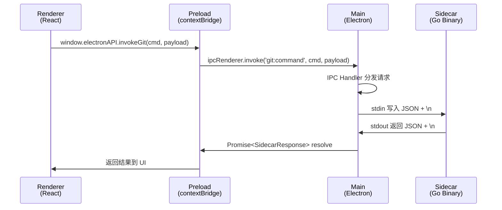

# IntelliGit 项目脚手架搭建 — 完成报告

## 概览

基于 `electron-vite` + React + TypeScript 成功搭建了 IntelliGit 智能 Git 工作流框架的完整项目骨架，包含 Sidecar 通信链路、模块化目录结构和工程化配置。


## 目录结构

```
IntelliGit/
├── sidecar/                        # Go 后端源码
│   ├── README.md                   # 通信协议文档 & 构建说明
│   ├── cmd/sidecar/.gitkeep
│   └── internal/
│       ├── protocol/.gitkeep
│       ├── git/.gitkeep
│       └── handler/.gitkeep
├── resources/                      # Go 二进制存放，生产打包时 extraResources
│   ├── icon.png
│   └── README.md
├── src/
│   ├── shared/                     # 跨层共享类型（main/preload/renderer 通用）
│   │   └── types/
│   │       ├── sidecar.ts          # SidecarRequest/Response, IPC_CHANNELS, ElectronAPI
│   │       └── index.ts
│   ├── main/                       # Electron 主进程
│   │   ├── core/
│   │   │   ├── SidecarManager.ts   # 🔑 Sidecar 进程管理器（spawn + stdin/stdout JSON）
│   │   │   └── index.ts
│   │   ├── features/               # 业务功能模块（独立分包）
│   │   │   ├── ai-commit/README.md
│   │   │   ├── smart-add/README.md
│   │   │   └── shadow-merge/README.md
│   │   ├── ipc/                    # IPC 通道集中注册
│   │   │   ├── gitHandlers.ts      # git:command 通道处理器
│   │   │   └── index.ts            # 统一注册入口
│   │   └── index.ts                # 主入口（生命周期 + Sidecar 启动 + IPC 注册）
│   ├── preload/
│   │   ├── index.ts                # 暴露 window.electronAPI.invokeGit()
│   │   └── index.d.ts              # 类型声明
│   └── renderer/
│       ├── index.html
│       └── src/
│           ├── App.tsx             # Sidecar 通信测试 UI
│           ├── store/              # Zustand 状态管理
│           │   ├── useGitStore.ts
│           │   └── index.ts
│           ├── hooks/              # 自定义 Hooks
│           │   ├── useKeyboardShortcut.ts
│           │   └── index.ts
│           ├── views/README.md     # 业务视图规划
│           ├── components/README.md # 基础组件规划
│           └── assets/main.css     # 全局样式（暗色主题设计系统）
├── electron-builder.yml            # 打包配置（含 extraResources）
├── electron.vite.config.ts
├── tsconfig.json / .node.json / .web.json
├── eslint.config.mjs
├── .prettierrc.yaml
└── package.json
```

## 通信链路



## 关键实现细节

### SidecarManager
- 使用 `child_process.spawn` 启动 Go 二进制
- 基于 **请求 ID** 的异步请求-响应配对机制
- 30 秒超时保护
- 进程异常退出时自动拒绝所有挂起请求
- 开发/生产环境的二进制路径自动切换

### IPC 通道
- `git:command`：渲染进程 → 主进程 → Sidecar 的完整通信链路
- 集中注册模式（`registerAllIpcHandlers`），便于扩展

### 打包配置
- `extraResources` 确保 Go 二进制在打包后位于 `process.resourcesPath`
- `asarUnpack` 保证 resources 目录不被打包进 asar

## 验证结果

| 检查项 | 状态 |
|---|---|
| TypeScript 编译（Node 侧） | ✅ 通过 |
| TypeScript 编译（Web 侧） | ✅ 通过 |
| `npm run dev` 启动 | ✅ 正常 |
| UI 渲染 | ✅ 正常 |
| Sidecar 缺失时的优雅降级 | ✅ 错误日志不崩溃 |

## 下一步

1. **编写 Go Sidecar**：在 `sidecar/cmd/sidecar/main.go` 中实现 stdin/stdout JSON 循环
2. **实现业务模块**：在 `src/main/features/` 各目录中开发具体功能
3. **搭建前端视图**：在 `src/renderer/src/views/` 中创建工作区、历史图等页面
4. **添加路由**：引入 React Router 管理多视图导航
