# IntelliGit 智能合并与冲突解决工作流设计 (2026-05-01)

## 1. 概述

在 IntelliGit 的架构中，为了提供极佳的开发者体验，我们设计了支持 **AI 辅助** 和 **人工手动** 混合的合并冲突解决机制。

本指南严格遵循 [Git 官方文档 (Basic Merge Conflicts)](https://git-scm.com/book/en/v2/Git-Branching-Basic-Branching-and-Merging#_basic_merge_conflicts) 的标准规范，详细说明了在调用 `remote.pull` 发生冲突后，前端或 AI 应该如何通过操作物理文件并调用 Sidecar API 来彻底完成合并。

## 2. 核心交互时序图

> [!NOTE]
> 核心思想：冲突解决的本质是直接对**物理文件**进行文本编辑。完成文本编辑后，通过完整的 `Pull -> 解决 -> Push` 工作流，即可实现本地与远端的代码同步。

```mermaid
sequenceDiagram
    participant Editor as 外部编辑器 / 处理层
    participant Frontend as 前端 UI (Zustand)
    participant Sidecar as Go Sidecar (Git API)
    
    Frontend->>Sidecar: 1. 发起 Pull (remote.pull)
    Sidecar-->>Frontend: 返回冲突错误 + conflictedFiles列表
    
    rect rgb(30, 30, 30)
        Note over Editor, Sidecar: 本地冲突解决循环
        Frontend->>Sidecar: 2. 获取实时状态 (merge.status)
        Sidecar-->>Frontend: 返回剩余冲突文件
        Frontend->>Editor: 3. 提供冲突文件路径与内容 (包含 <<<<<<<)
        Editor->>Editor: 4. 修改物理文件，删除标记，保留最终代码
        Frontend->>Sidecar: 5. 标记该文件已解决 (staging.add)
    end
    
    Frontend->>Sidecar: 6. 确认合并 (merge.continue)
    Sidecar-->>Frontend: 自动生成 Merge Commit，合并结束
    
    Frontend->>Sidecar: 7. 推送云端 (remote.push)
```



## 3. 标准操作流详解

### 步骤一：感知冲突
前端调用 `remote.pull` 时，如果发生冲突，Sidecar 不会抛出常规报错，而是返回带有特定结构的数据：
```json
{
  "success": false,
  "data": {
    "conflictedFiles": ["src/main.ts", "README.md"],
    "mergingBranch": "origin/main",
    "message": "CONFLICT (content): Merge conflict in src/main.ts"
  }
}
```
此时前端应进入“冲突解决模式”。

### 步骤二：修改物理文件（解决冲突）
发生冲突后，Git 已经在相关的物理文件中注入了冲突标记。此时需直接修改该物理文件，消除冲突标记。

**修改前（冲突状态）**：
```text
<<<<<<< HEAD
console.log("本地新写的逻辑");
=======
console.log("远端其他人写的逻辑");
>>>>>>> origin/main
```

**操作动作**：
通过外部处理层打开该文件，手动或自动化地删除掉 `<<<<<<<`、`=======`、`>>>>>>>` 所在行，并将代码整理为最终需要的正确逻辑。

**修改后（解决状态）**：
```text
console.log("合并后最终保留的正确逻辑");
```
保存该物理文件。此时硬盘上的文件内容已正确，但 Git 索引尚未感知，需要进行下一步的同步。

### 步骤三：标记该文件为“已解决” (对应 `git add`)
> [!IMPORTANT]
> 依据 Git 官方文档说明：*"After you resolve each of these sections in each conflicted file, run `git add` on each file to mark it as resolved."*

当一个物理文件被正确修改并保存后，必须调用 Sidecar 的 API 告知 Git 底层：
- **API**: `staging.add`
- **参数**: `{ paths: ["src/main.ts"] }`
这会清除该文件在 Git 索引中的 Unmerged 状态（Stage 1/2/3 被合成为标准的 Stage 0）。

### 步骤四：检查是否全部解决 (对应 `git status`)
前端可以随时调用 `merge.status` 检查进度：
- **API**: `merge.status`
- **返回值**: `{ merging: true, conflictedFiles: ["README.md"] }`
如果返回的 `conflictedFiles` 数组为空，说明所有的冲突都已经标记解决完毕，可以进行下一步。

### 步骤五：完结合并并生成 Commit (对应 `git commit`)
> [!IMPORTANT]
> 依据 Git 官方文档说明：*"If you’re satisfied that all conflicts are resolved and you’ve staged them, you can type `git commit` to finalize the merge commit."*

当所有冲突解决后，必须提交合并来关闭整个中间状态。
- **API**: `merge.continue`
- **说明**: 该接口底层执行 `git commit --no-edit`。系统 Git 会自动读取 `.git/MERGE_MSG`，生成一条有两个父节点的标准 Merge 提交记录，并清理 `.git/MERGE_HEAD`。

### 步骤六：推送云端 (对应 `git push`)
合并产生的 Merge Commit 目前仅存在于你的本地仓库中，你需要将其推送到远端同步。
- **API**: `remote.push`

## 4. 异常处理：放弃合并 (Abort)
如果在解决冲突的过程中，用户觉得代码被改得面目全非，想要退回 Pull 之前的安全状态。
- **API**: `merge.abort`
- **底层机制**: 对应 `git merge --abort`，这会立刻丢弃所有在解决冲突过程中的未提交修改，并将本地工作区瞬间恢复到触发 Pull 之前的模样。
